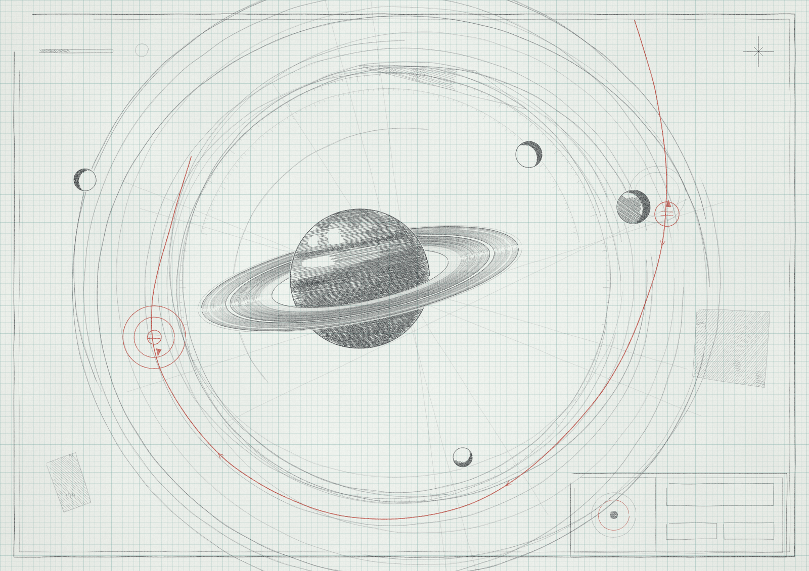

# Hand-drawn sketches

Procedural "pencil on graph paper" drawings in plain canvas 2D JavaScript.

- `lib/sketch.js`: toolkit (seeded random numbers, value noise, wobbly multi-pass strokes, tonal hatching, clipping/occlusion, paper, grid, graphite grain)
- `scenes/*.js`: one file per drawing, each registers `Scenes.<name>(canvas, seed)`
- `index.html`: open in a browser (`?scene=saturn&seed=7`)
- `render.mjs`: headless render to `out/<scene>-<seed>.png` (`npm i && node render.mjs saturn 7`)

